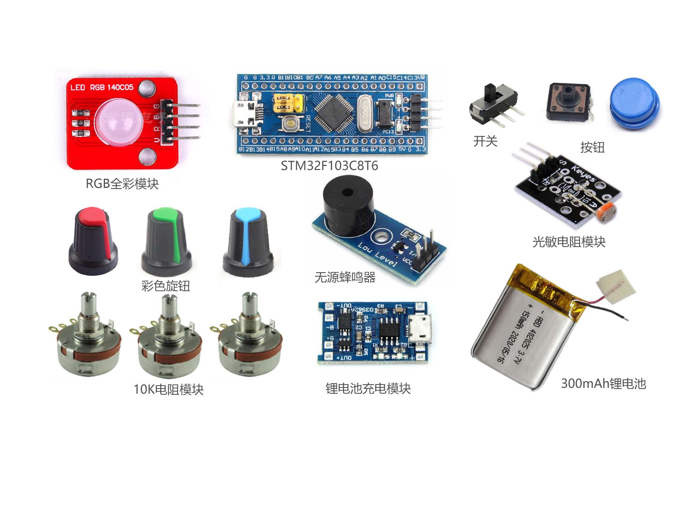

# rgb toy




STM32代码

芯片型号: STM32F103C8T6

编译通过的Rust版本: rustc 1.43.0-nightly

## 安装 Rust和一些工具

https://www.rust-lang.org/zh-CN/tools/install

https://docs.rust-embedded.org/book/intro/tooling.html

https://blog.csdn.net/niuiic/article/details/113407435

```bat
:: 切换至nightly
rustup default nightly
:: 安装交叉编译工具
rustup target add thumbv7m-none-eabi

:: 安装 cargo-binutils
cargo install cargo-binutils
rustup component add llvm-tools-preview

:: 安装 cargo-generate
cargo install cargo-generate
```

## 安装arm-none-eabi-gdb工具

https://developer.arm.com/open-source/gnu-toolchain/gnu-rm/downloads

```bat
:: 验证
arm-none-eabi-gdb -v
```

## 安装 openocd

https://xpack.github.io/openocd/install/

```bat
::安装xpm
npm install --global xpm@latest
::验证安装
dir "%APPDATA%"\npm\xpm*
xpm --version
::安装openocd
xpm install --global @xpack-dev-tools/openocd@latest --verbose
::验证安装
%USERPROFILE%\AppData\Roaming\xPacks\@xpack-dev-tools\openocd\0.11.0-1.1\.content\bin\openocd.exe --version

::将openocd的bin路径添加到path中
openocd -v

```

## 连接st-link v2

安装驱动：https://www.st.com/en/development-tools/stsw-link009.html#get-software

```text
Warn : UNEXPECTED idcode: 0x2ba01477
Error: expected 1 of 1: 0x1ba01477
```

找到 openocd 的安装目录，将/scripts/target/stm32f1x.cfg中的set _CPUTAPID 0x1ba01477修改为set _CPUTAPID 0x2ba01477

## openocd连接 stlink
```bat
::在新的窗口中启动
openocd -f interface/stlink.cfg -f target/stm32f1x.cfg

::注意：端口6666不能被占用 否则提示 Error: couldn't bind tcl to socket on port 6666: No error

::查看所有端口
netstat -ano
:: 结束指定的PID进程
tasklist|findstr PID
```

将st-link v2连接到stm32和电脑，在当前路径下打开控制台窗口运行openocd，再在当前路径下打开另一个控制台窗口，运行run.cmd。

## 查看控制台输出

```rust
// 在openocd控制台可看到输出
use cortex_m_semihosting::hprintln;
hprintln!("start!").unwrap();
```